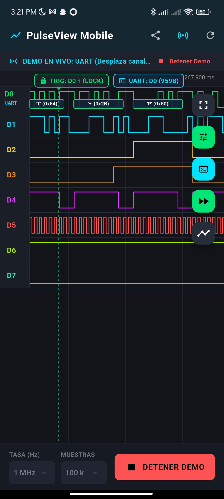
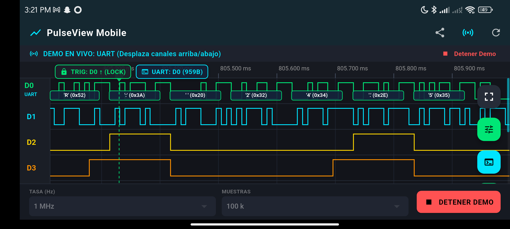
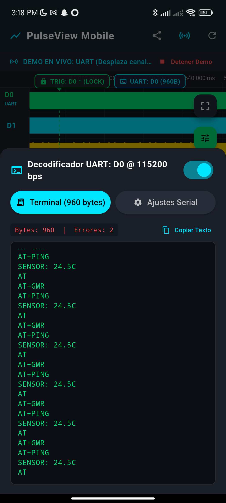
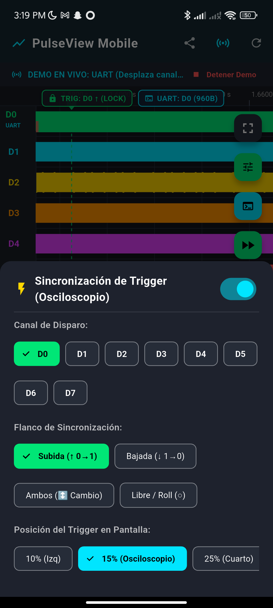
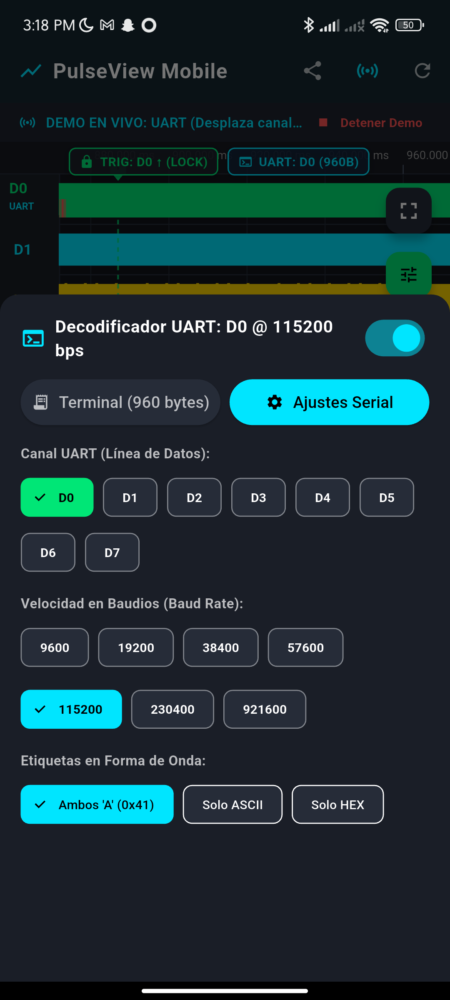
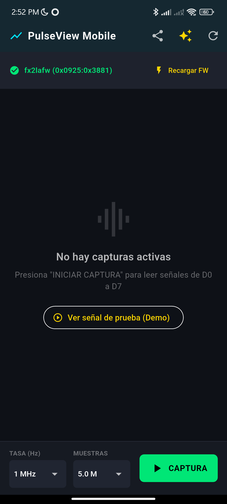

# PulseView Mobile 📱⚡🔬

[](https://flutter.dev)
[-3DDC84?style=for-the-badge&logo=android&logoColor=white)](https://developer.android.com)
[](https://sigrok.org/wiki/Fx2lafw)
[](https://sigrok.org)
[](LICENSE)

**PulseView Mobile** is an open-source, high-performance digital logic analyzer, oscilloscope-style waveform viewer, and protocol decoder application for Android, built with **Flutter**.

It interfaces directly via **USB OTG** with low-cost **Cypress FX2LP (CY7C68013A)** 8-channel / 16-channel logic analyzers (such as Saleae Logic 8 clones, USBee AX, CWAV, and DDS120), uploading open-source `sigrok fx2lafw` firmware on-the-fly without requiring root permissions. It also includes comprehensive real-time signal generation and streaming engines for field testing and lab simulations.

---

## 📸 Screenshots & Showcase

| Waveform with Decoded UART Bubbles | Landscape Mode (Channels D0-D7 Scroll) |
|:---:|:---:|
|  |  |

| Live Serial Terminal (Matrix Green) | Oscilloscope Trigger Configuration |
|:---:|:---:|
|  |  |

| Protocol Decoder Settings (UART / Baud) | Physical Hardware Capture (USB OTG) |
|:---:|:---:|
|  |  |

---

## ✨ Key Features

### 🔌 Direct USB OTG Hardware Capture
- **Plug-and-Play Automatic Enumeration:** Detects Cypress FX2LP devices (VID `0x04B4` / `0x0925`, PID `0x8613` / `0x3881`).
- **In-App Intel HEX Firmware Ingestion:** Programmatically resets the 8051 core via USB vendor request `0xA0` to `0xE600` (CPUCS), streaming the open-source `fx2lafw` firmware into internal SRAM and reenabling the core.
- **High-Speed Sample Rates:** Capture rates up to **24 MHz** across 8 digital channels simultaneously through USB 2.0 High-Speed Bulk Endpoint (`0x82`).
- **No Root Required:** Employs the Android `UsbManager` and `UsbDeviceConnection` API with standard user permission prompts.

### 🔒 Oscilloscope-Style Trigger Synchronization
- **Waveform Phase-Locking:** Eliminates visual jitter and drift in continuous streaming mode by anchoring the waveform to real-time transitions.
- **Slope Detection (Slopes):**
  - `Rising ↑`: Triggers on low-to-high transitions.
  - `Falling ↓`: Triggers on high-to-low transitions.
  - `Any ⇅`: Triggers on either edge.
  - `None / Roll`: Free-running continuous acquisition.
- **Selectable Trigger Source:** Any digital input from **D0 to D7**.
- **Adjustable Horizontal Position:** Position the trigger marker at **10%**, **15%**, **25%**, or **50%** across the screen to analyze pre-trigger and post-trigger events.
- **Visual Feedback:** Synchronized dashed trigger line with an upper scale marker (`▼ T`) tinted with the channel's designated color.

### 💬 Real-Time UART Protocol Decoder
- **Zero-Drift Bit Accumulation:** Uses floating-point sub-sample calculations (`sampleRate / baudRate`) to eliminate quantization errors, allowing indefinite decoding of continuous high-speed streams without timing drift.
- **Inline Waveform Bubbles:** Decoded bytes are rendered as rounded graphical packets over the signal track, displaying ASCII characters and HEX codes (e.g. `<'A' (0x41)>`).
- **Framing Error Detection:** Highlights malformed bytes (missing stop bits) with high-contrast red warning bubbles.
- **Integrated Live Serial Console:**
  - Monospace Matrix-Green terminal displaying live ASCII and HEX dumps.
  - Real-time packet and framing error statistics.
  - Single-tap copy to clipboard and clear buffer actions.
  - Flexible configuration: Baud rate (9600 to 921600+ bps), Data bits (5-8), Parity (None, Even, Odd), and Stop bits (1, 1.5, 2).

### 🔍 Interactive Waveform Canvas
- **Pinch-to-Zoom & Pan:** Smooth zoom ranging from nanoseconds per pixel up to full capture overview.
- **Vertical Scroll in Landscape:** Channel tracks smoothly scroll vertically with a sticky, pinned time ruler and a stylized scroll position bar.
- **Dual Measurement Cursors:** Movable cursors with instant readout of Cursor 1, Cursor 2, time delta ($\Delta t$), and calculated frequency ($1/\Delta t$).
- **Optimized High-DPI Rendering:** Flutter `CustomPainter` with boundary clipping and sample-space viewport transformation.

### 💾 Sigrok Native File Export (`.sr`)
- Creates standard **Sigrok `.sr`** archive files directly on the mobile device.
- Bundles `metadata` (sample rate, channel mapping, version), raw binary stream (`logic-1-1`), and `version` into a valid ZIP package.
- Open directly in desktop **PulseView** or share via email, Google Drive, or messaging apps using the native Android Share Sheet.

### 🧪 Built-in Signal Generator Scenarios
1. **Demo Serial UART (115200 8N1):** Realistic AT commands (`AT`, `AT+GMR`, `AT+PING`, `SENSOR: 24.5C\r\n`), responses on D1, hardware flow control RTS/CTS on D2/D3, TX activity LED on D4, 115.2 kHz baud clock on D5, and heartbeat on D7.
2. **Mixed Bus Traffic:** 100 kHz master clock (D0), SPI MOSI (D1), SPI CS# (D2), I2C SCL bursts (D3), I2C SDA (D4), UART TX (D5), sine-modulated PWM (D6), and 1 Hz heartbeat (D7).
3. **I2C Sensor Transaction:** Complete I2C master-slave read transaction with Start condition, 7-bit slave address `0x48`, Read bit, ACK pulses, data payload, and active-low interrupt line.
4. **Motor PWM & Quadrature Encoder:** 20 kHz PWM at 75% duty cycle, motor direction line, optical encoder Phase A and Phase B in 90° quadrature, and index pulse.

---

## 🏗️ Architecture & Codebase Layout

```
logic_analyzer_flutter/
├── android/                         # Android native USB host integration & manifest
│   └── app/src/main/
│       ├── AndroidManifest.xml      # USB host feature & USB device-attached filters
│       └── res/xml/device_filter.xml# Cypress FX2 VID/PID hardware filters
├── assets/
│   └── firmware/                    # fx2lafw open-source 8051 firmware blobs
│       ├── fx2lafw-cypress-fx2.fw
│       └── fx2lafw-saleae-logic.fw
├── docs/
│   └── screenshots/                 # Application visual documentation
├── lib/
│   ├── models/
│   │   ├── trigger_config.dart      # Oscilloscope trigger state & transition search
│   │   └── uart_packet.dart         # UART configuration & packet data models
│   ├── services/
│   │   ├── cypress_fx2.dart         # USB enumeration, EZ-USB 8051 RAM upload & capture
│   │   ├── sigrok_export.dart       # Sigrok .sr ZIP container packaging
│   │   ├── signal_generator.dart    # Live streaming scenarios & continuous buffer
│   │   └── uart_decoder.dart        # Real-time zero-drift UART state machine
│   ├── ui/
│   │   ├── waveform_painter.dart    # CustomPainter rendering signals, triggers, bubbles
│   │   └── waveform_viewer.dart     # Gestures, cursors, modals, terminal & time ruler
│   └── main.dart                    # Application entrypoint & USB lifecycle manager
├── pubspec.yaml                     # Dependencies & asset manifests
└── README.md
```

---

## ⚡ Supported Hardware & Pinout

Any **Cypress EZ-USB FX2LP (CY7C68013A)** based USB logic analyzer is supported:

- **Saleae Logic 8 Clones** (24 MHz 8-Channel USB Logic Analyzer)
- **CWAV USBee AX / SX / ZX**
- **Hantek 6022BE / 6022BL**
- **SainSmart DDS120**
- **Generic FX2LP Development Boards**

### Connection Pinout

| Pin Label | Function | Description |
|:---:|:---:|:---|
| **D0 (CH1)** | Digital Input 0 | Logic channel 0 (3.3V / 5V tolerant) |
| **D1 (CH2)** | Digital Input 1 | Logic channel 1 |
| **D2 (CH3)** | Digital Input 2 | Logic channel 2 |
| **D3 (CH4)** | Digital Input 3 | Logic channel 3 |
| **D4 (CH5)** | Digital Input 4 | Logic channel 4 |
| **D5 (CH6)** | Digital Input 5 | Logic channel 5 |
| **D6 (CH7)** | Digital Input 6 | Logic channel 6 |
| **D7 (CH8)** | Digital Input 7 | Logic channel 7 |
| **GND** | Ground Reference | Connect to Target Board Common Ground |

> [!IMPORTANT]
> Always connect **GND** on the logic analyzer to the common ground of your Device Under Test (DUT) to ensure clean logic levels and prevent ground loops.

---

## 🚀 Getting Started

### Prerequisites

- **Flutter SDK:** 3.24.0 or newer
- **Dart SDK:** 3.12.0 or newer
- **Android Device:** Android 8.0 (Oreo / API 26) or newer with **USB OTG** support
- **USB OTG Adapter:** USB-C to USB-A (or Micro-USB to USB-A) adapter to connect the logic analyzer to your phone.

### Build and Run

1. **Clone the repository:**
   ```bash
   git clone https://github.com/fbetancourt-dev/logic_analyzer_flutter.git
   cd logic_analyzer_flutter
   ```

2. **Fetch dependencies:**
   ```bash
   flutter pub get
   ```

3. **Connect your Android phone via ADB:**
   ```bash
   adb devices
   ```

4. **Run on your connected phone:**
   ```bash
   flutter run --release
   ```

5. **Build standalone APK:**
   ```bash
   flutter build apk --release
   ```
   The APK will be generated at:
   `build/app/outputs/flutter-apk/app-release.apk`

---

## 🗺️ Roadmap & Upcoming Decoders

- [x] **Cypress FX2LP USB OTG Driver & Firmware Loader**
- [x] **Multi-Touch Waveform Viewer with Cursors & Time Ruler**
- [x] **Sigrok (.sr) Export Container**
- [x] **Anti-Flicker Continuous Streaming Buffer**
- [x] **Oscilloscope-Style Trigger Synchronization (Rising, Falling, Any)**
- [x] **Real-Time UART Protocol Decoder & Matrix Green Serial Terminal**
- [ ] **I2C Protocol Decoder** (Start/Stop, 7-bit address, Read/Write, Data bytes, ACK/NACK)
- [ ] **SPI Protocol Decoder** (CPOL/CPHA modes, CS# active framing, simultaneous MOSI/MISO)
- [ ] **CAN Bus 2.0A/2.0B Protocol Decoder**
- [ ] **1-Wire Protocol Decoder** (Dallas / Maxim sensors)

---

## 📄 License & Attribution

- **Application Code:** Licensed under the [GNU General Public License v3.0](LICENSE).
- **Firmware:** Incorporates open-source firmware binaries from the [sigrok fx2lafw project](https://sigrok.org/wiki/Fx2lafw), licensed under the GNU GPL v2+.
- Built with ❤️ using [Flutter](https://flutter.dev).

